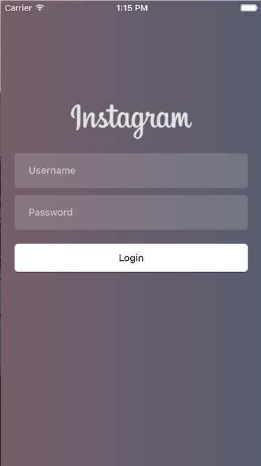
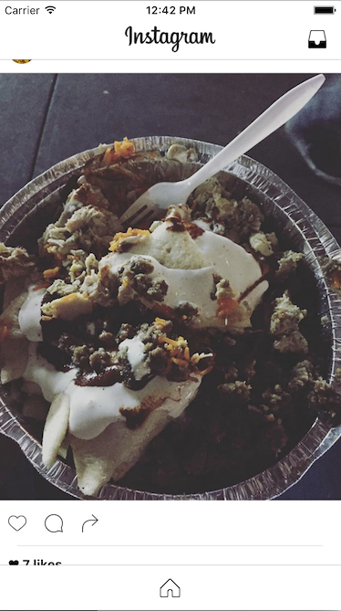

# JKHInstagramClone

## Overview

JKHInstagramClone is a very basic clone of the iOS Instagram app written in Objective-C. It was built using various frameworks including Instagram's own IGListKit. This project was built solely for educational purposes and not intended for commercial use in any way.

This project was built to experiment with the following:

1. Programmatic Views (No Storyboarding)
2. Programmatic Auto Layout Constraints
3. IGListKit
4. Animating Background Gradient

See the example below:

## Usage

To run the clone, you'll need to replace the macros in the InstagramAPI.h file with your own Instagram App Client ID and Redirect URL. The redirect URL can be anything as long as it starts with https according to Instagram's rules. This does not have to be a valid address.

## Requirements

- Xcode 7+
- iOS 9.0 or higher

## Change Log

### 1.0
- First release

## Author

Joon Ki Hong jhong70@icloud.com
